   <h1>Hi 👋. </h1>

- 😄 Nice to meet you guys. 
- 🚀 I’m an game developer
- 🚢 Open source contributor
- 💬 Learned about Unity or Technical art
- 👑 HotChocolate, MassTransit and Quartz
- 📫 How to reach me? QQ : 574809918, mail: 574809918@qq.com
- 😄 Enjoy your self!

 

   

  
  &emsp;
  

<!--  -->

<!-- 

     <iframe id="music_frame" frameborder="no" border="0" marginwidth="0" marginheight="0" width=330 height=86
         src="https://music.163.com/outchain/player?type=2&id=425295760&auto=1&height=66">
     </iframe>

 -->

